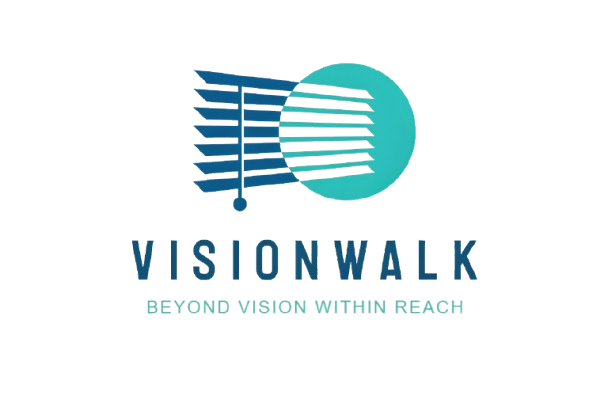

# VisionWalk
VisionWalk - A mobile AI app for the visually impaired, ensuring safety and independence with real-time alerts and text-to-speech technology.


For better understanding and detailed explanations, our report is [here](doc/Report.pdf).


<div align="center">
  
</div>

## Introduction  

Navigating crowded streets and public spaces poses significant challenges for individuals with visual impairments. Their inability to detect obstacles, traffic signs, or changes in their environment often leads to a higher risk of accidents and limits their independence in movement. With the advancements in technology, AI-driven solutions have emerged as a potential tool to assist visually impaired individuals in moving safely and effectively.  

The **VisionWalk** project aims to address these challenges by developing an AI-powered navigation assistant specifically designed to support visually impaired users in real-time mobility. Utilizing computer vision techniques and AI models, VisionWalk can identify critical traffic signs, obstacles, and potential hazards along the way, providing timely auditory alerts to guide users.  

This application focuses on three primary functions: real-time traffic sign recognition, detection of static and dynamic obstacles, and providing real-time alerts and directions to ensure safe navigation. By utilizing the camera of a mobile device through the app, the system will identify and classify traffic signs such as pedestrian restrictions, crosswalks, and obstacles like lamp posts, vehicles, or construction areas. Additionally, the application will calculate the distance and direction of moving obstacles, issuing corresponding alerts to users.  

The system will be optimized for use on popular mobile platforms, ensuring accessibility for users without the need for special hardware. Through this project, we aspire to enhance the independence and safety of visually impaired individuals while contributing to a more inclusive society where AI technology improves the quality of life for vulnerable groups.


## Model and Technologies
First let's take a quick sight at the technologies we used in VisionWalk:

<div align="center">  
  
  
*Models and technologies used in VisionWalk*  
</div>

1. **Image Processing and AI Models:**  
   - **Gemini 1.5 by Google:** Detects objects and recognizes traffic signs.  
   - **TensorFlow Lite & PyTorch Mobile:** Optimizes model performance for mobile devices.  

2. **Interaction Technology with AI:**  
   - **Google Cloud Text-to-Speech (TTS) and Speech-to-Text (STT):** Allows audio alerts for users and the ability to respond verbally.  
   - **Noise Suppression:** Reduces background noise using features from Google Cloud Speech.  
   - **Voice Generation:** Utilizes AI for voice interactions, similar to Siri or Alexa.  

3. **Mobile Application Development:**   
   - The app is developed using React Native and integrated with **Expo**, allowing it to run on both **Android** and **iOS**. The use of iOS ensures security and a wide range of functionalities. The Framework **FastAPI** is used to build the API.

## Pipeline and Architecture
<div align="center">  

  
*Processing pipeline of VisionWalk*  

<br>  

  
*Architecture of the VisionWalk application*  

</div>

## GUI and Functions
In addition to the main functionality of image processing, our application offers several additional features:  

- **Q&A Support:** Enables users to interact with the system via voice.  
- **Location Tracking:** Assists in determining user position and guides them to their desired destination.  
- **Activity History:** Tracks the user's interactions with the system and stores basic profile information.

The simulation for VisionWalk application can be viewed by the design below:
<div align="center">  
  
  
*VisionWalk's simulation*  
</div>

  


## About Installation

To set up the VisionWalk application, follow the steps below to set up the environment and install the necessary dependencies.

### Prerequisites  
 
Make sure to install essential dependencies and have the following installed:  

- **Node.js** (v14 or above) - Required for React Native development.  
- **Expo CLI** - For managing the React Native app.
  
  ```bash  
  npm install -g expo-cli

You can access [this repository](https://github.com/expo/expo) or below to learn more about **Expo**

> <!-- Banner Image -->  
>   
> <p align="center">  
>   <a href="https://expo.dev/">  
>       
>     <h1 align="center">Expo</h1>  
>   </a>  
> </p>  
>   
> <p align="center">  
>    <a aria-label="SDK version" href="https://www.npmjs.com/package/expo" target="_blank">  
>       
>    </a>  
>    <a aria-label="Chat or ask a question" href="https://chat.expo.dev" target="_blank">  
>       
>    </a>  
>    <a aria-label="Expo is free to use" href="https://github.com/expo/expo/blob/main/LICENSE" target="_blank">  
>       
>    </a>  
>    <a aria-label="expo downloads" href="http://www.npmtrends.com/expo" target="_blank">  
>       
>    </a>  
> </p>  
>   
> <p align="center">  
>   <a aria-label="try expo with snack" href="https://snack.expo.dev"><b>Try Expo in the Browser</b></a>  
> &ensp;•&ensp;  
>   <a aria-label="expo documentation" href="https://docs.expo.dev">Read the Documentation</a>  
> &ensp;•&ensp;  
>   <a aria-label="expo documentation" href="https://expo.dev/blog">Learn more on our blog</a>  
> &ensp;•&ensp;  
>   <a aria-label="expo documentation" href="https://expo.canny.io/feature-requests">Request a feature</a>  
> </p>  
>   
> <h6 align="center">Follow us on</h6>  
> <p align="center">  
>   <a aria-label="Follow @expo on X" href="https://x.com/intent/follow?screen_name=expo" target="_blank">  
>       
>   </a>&nbsp;  
>   <a aria-label="Follow @expo on GitHub" href="https://github.com/expo" target="_blank">  
>       
>   </a>&nbsp;  
>   <a aria-label="Follow @expo on Reddit" href="https://www.reddit.com/r/expo/" target="_blank">  
>       
>   </a>&nbsp;  
>   <a aria-label="Follow @expo on Bluesky" href="https://bsky.app/profile/expo.dev" target="_blank">  
>       
>   </a>&nbsp;  
>   <a aria-label="Follow @expo on LinkedIn" href="https://www.linkedin.com/company/expo-dev" target="_blank">  
>       
>   </a>  
> </p>  


### Clone the Repository

```bash
git clone https://github.com/PrORain-HCMUS/VisionWalk
cd https://github.com/PrORain-HCMUS/VisionWalk
```

## Demo Instructions  

To experience the VisionWalk application on your mobile device during the `demo phase`, please follow these steps:  

1. **Connect Your Device**: Use a USB cable to connect your mobile device to your laptop.  

2. **Set up Server**: If you haven't already, start the server by running:  

```bash
cd VisionWalkServer/src/vision_api.py
python vision_api.py
```

3. **Set up Client**: Next, start the client by running:
```bash
cd VisionWalkClient
npx expo start
```

##  About the team:  
Finally we would like to introduce the contributors of this repo:

|     | Contributor          | Student ID | Github                               |  
|:---:|:--------------------:|:----------:|:------------------------------------:|  
| 1   | Dai-Hoa Le           | `22120108` | [JustinHoa](https://github.com/JustinHoa) |    
| 2   | Tuong-Bach-Hy Nguyen | `22120455` | [nguyentuongbachhy](https://github.com/nguyentuongbachhy) |  
| 3   | Hai_Luu_Danh Lieu    | `22120459` | [lhldanh](https://github.com/lhldanh) |  
| 4   | Hoang-Vu Le          | `22120461` | [PrORain-HCMUS](https://github.com/PrORain-HCMUS) | 


